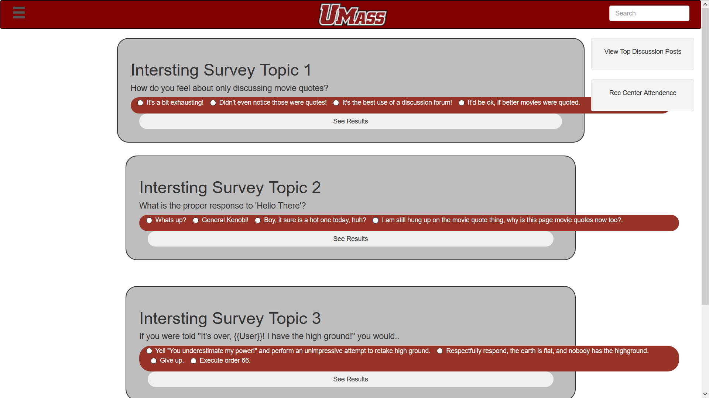

# c_3hunnit

# UMass Report

# Team Overview

* Conor Carmichael, Conor-Carmichael
* Stephen Ulich, stulich
* Monmoy Mohsin, monmoymohsin
* Harsha Malireddy, HarshaMalireddy
* Arjun Singh, arjunsingh1997
* Kyle Ewell, KyleEwell1

# Innovative Idea

A website to bring the UMass community together, through general and class based discussions, and polls to get a sense of how the community as a whole feels about topics pertinent to our campus. This site can be thought almost as a Reddit specific to the UMass community. Popular discussions in the community and popular polls will be displayed on the home screen.

# Important Data

Our application will support the following data types: discussions post data, survey post data, survey result data, user comment data, tag data.  Discussion post data is what makes up the discussion that is submitted like the title and comments. Survey post data is the data that is used to build surveys for the site, this can be the type of survey it is, what are the categories the user can select from, if they can enter their own, etc. The survey result data is the data inputted from users that are how people answer the polls and surveys added. The user comment data is the data the data that has the comments to discussions which includes the username and contents of the response. The tag is the data that basically classifies the survey or post to one part of the UMass community. For instance the tag can be something along the lines of ‘CS326’ or ‘UMass Athletes”.

# User Interface

Provide a description and images of the user interface your
application will intend on supporting.

The surveys that are currently new/popular will be displayed in one main feed. There users can interact with them, or potentially search for more, and then if desired create there own.

